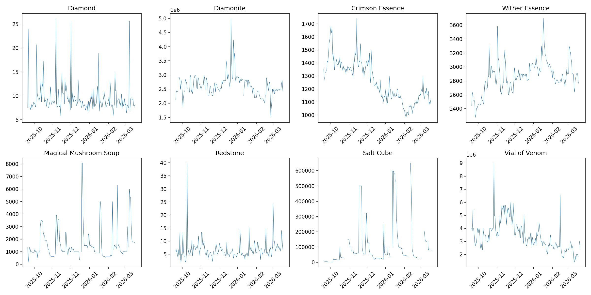

# Item Stock Behavior

Eight items were tested.
We analyzed the behavior of the percent change to returns over time, quantized to one-hour blocks.
The items exhibit a timeseries plot that visually appears consistent with the random behavior of Brownian motion, which may be worth studying.

| Item | Mean Price | Std | CV | Min | Max | N |
|------|-----------|-----|-----|-----|-----|---|
| Diamond | 9.44 | 3.14 | 0.3320 | 5.50 | 26.20 | 181 |
| Diamonite | 2620790.54 | 369648.80 | 0.1410 | 1499999.80 | 4999999.70 | 180 |
| Crimson Essence | 1257.27 | 155.32 | 0.1235 | 982.20 | 1742.50 | 181 |
| Wither Essence | 2858.64 | 220.34 | 0.0771 | 2274.80 | 3698.20 | 181 |
| Magical Mushroom Soup | 1592.08 | 1309.32 | 0.8224 | 169.00 | 8073.90 | 178 |
| Redstone | 6.78 | 3.68 | 0.5428 | 2.00 | 39.90 | 179 |
| Salt Cube | 107940.93 | 150386.84 | 1.3932 | 949.90 | 649999.80 | 164 |
| Vial of Venom | 3399032.62 | 1114057.26 | 0.3278 | 1412265.80 | 8999997.50 | 181 |

# Inter-Item Correlations

There exists no statistically significant correlation between any two nonsame items.
That is, of the items tested, for any items i and j, where i and j are not the same item, there is no correlation between the price of i and the price of j.
Knowing the price of one gives no information about the price of another.

# Autocorrelation using Lag-Prices

Diamond and Crimson Essence are the only items to have a statistically significant correlation between price and lag-price, and this correlation occurs between the current price and the price from one hour ago.
In my experience, these are also some of the most intensely traded items, with a significant trade market due to players speculating on prices in order to profit.
As a result, I hypothesize that the one-hour significant lag relation may be caused by speculators attempting to predict future price based on current price, and thus causing a relation to exist.

# Volatility

The market is very volatile, but the volatility varies.
Some items are more volatile than others.
The lowest volatilities were the Salt Cube and the Magical Mushroom Soup, with volatilities of roughly 5.57 and 5.89, respectively.
Meanwhile, the highest volatility is Crimson Essence, whose volatility is about 352.53.
This means that the Crimson Essence item's noise is over 350 times larger than the signal, whereas the Salt Cube item's noise is merely 5 times larger than signal.

A comparison may be drawn:

Salt Cubes and Magical Mushroom Soups may be considered stable investments, akin to buying stock in utilities.
While they may vary heavily, they still vary minimally compared to other investments, and thus are far better than other investments.
We expect them not to dip too heavily, at the expense of also not rising enough to be a viable speculation.

Meanwhile, Crimson Essence is so incredibly volatile that it's value can not reliably be estimated without a very large sample size.
It is extremely liable to jump around.
It may be useful for speculation, as it can sometimes increase in value dramatically, but it can decrease as readily as it can increase, making it an unreliable investment.

| Item | Volatility |
---------------------
| Diamond | 7.118146 |
| Diamonite | 15.170113 |
| Crimson Essence | 352.530116 |
| Wither Essence | 31.594726 |
| Magical Mushroom Soup | 5.887288 |
| Redstone | 6.224032 |
| Salt Cube | 5.569963 |
| Vial of Venom | 13.178217 |

