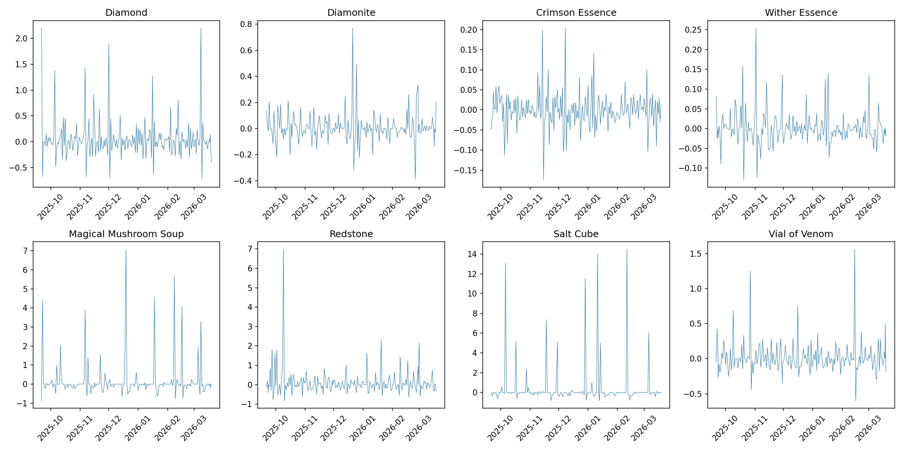
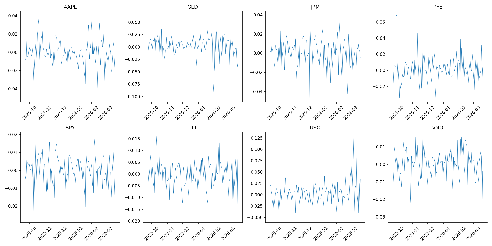
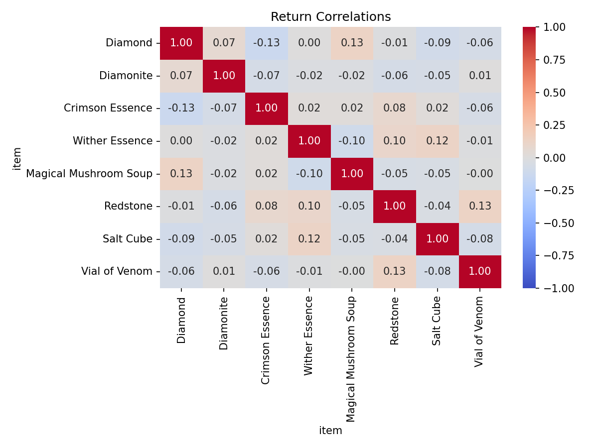
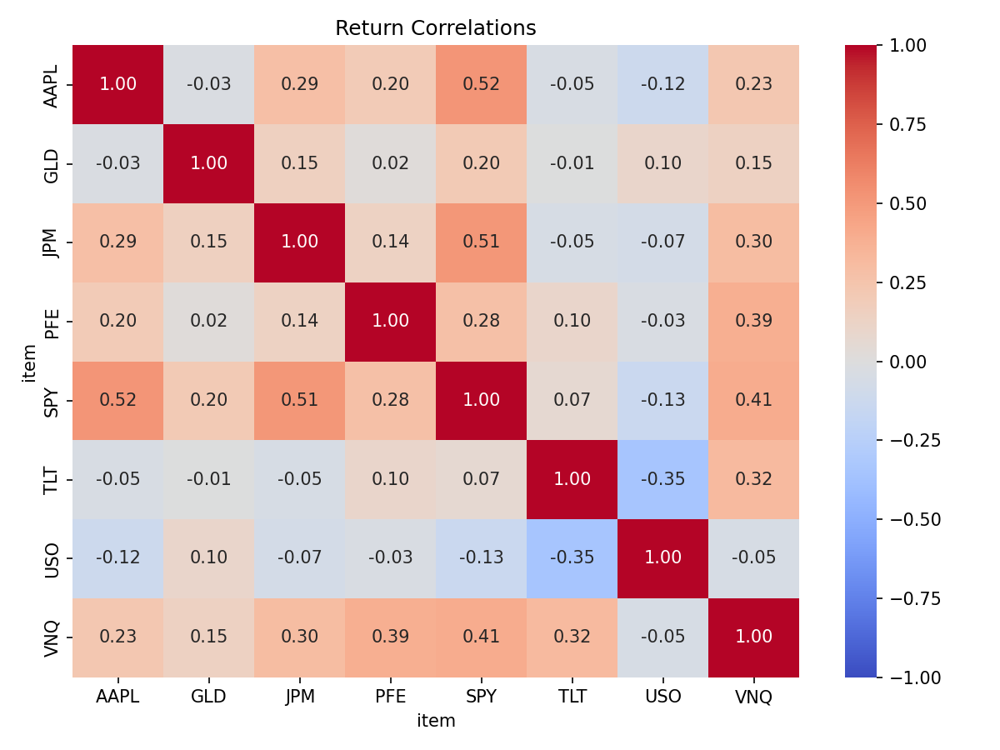
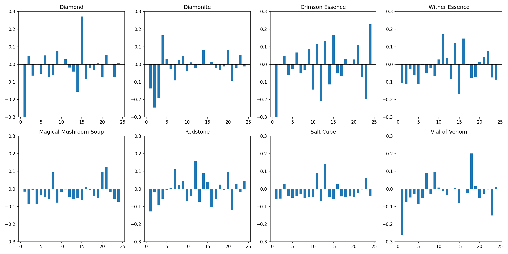
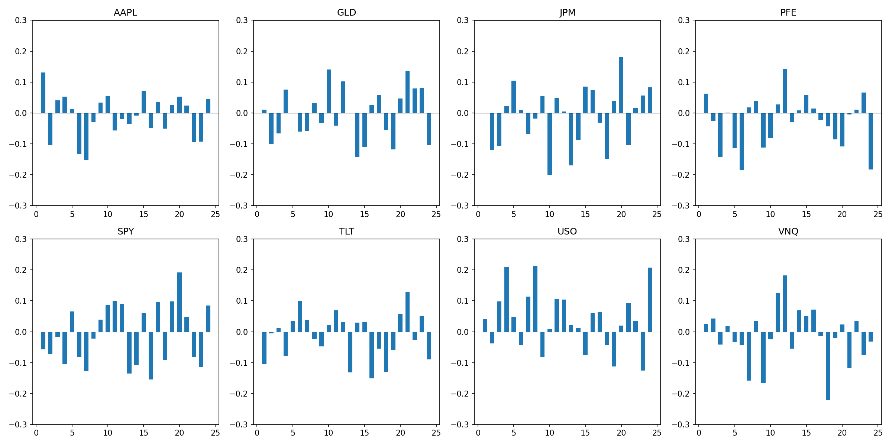

Economic analyses of markets are commonplace, but frequently constrained to markets with immediate practical applications.
However, video games such as Hypixel's Skyblock (which is a open-world RPG programmed inside of Minecraft), often offer advanced economies with unusual governmental policies, economic systems, and social cultures.
As a result, we've elected to study a subset of the economy of Hypixel Skyblock.

In particular, we observed the stock of eight in-game items and analyzed their behavior in several ways.
The item names are in the following table.
We used a line-plot, an inter-item correlation, lag-price correlation, and a volatility metric.

| Item name            | Item ID              |
|----------------------|----------------------|
| Diamond              | DIAMOND              |
| Redstone             | REDSTONE             |
| Magical Mushroom Soup | MAGIC_MUSHROOM_SOUP |
| Vial of Venom        | VIAL_OF_VENOM        |
| Salt Cube            | SALT_CUBE            |
| Diamonite            | DIAMONITE            |
| Wither Essence       | ESSENCE_WITHER       |
| Crimson Essence      | ESSENCE_CRIMSON      |

# Item Stock Behavior

Eight items were tested.
We analyzed the behavior of the returns over time, quantized to one-hour blocks.
The items exhibit a timeseries plot that visually appears consistent with the random behavior of Brownian motion, which may be worth studying.

| Item | Mean Price | Std | CV | Min | Max | N |
|------|------------|-----|----|-----|-----|---|
| Diamond | 0.06 | 0.40 | 7.1181 | -0.73 | 2.20 | 183 |
| Diamonite | 0.01 | 0.11 | 15.1701 | -0.39 | 0.77 | 183 |
| Crimson Essence | -0.00 | 0.05 | -352.5301 | -0.17 | 0.20 | 183 |
| Wither Essence | 0.00 | 0.04 | 31.5947 | -0.13 | 0.25 | 183 |
| Magical Mushroom Soup | 0.17 | 1.00 | 5.8873 | -0.87 | 7.07 | 183 |
| Redstone | 0.11 | 0.70 | 6.2240 | -0.83 | 6.98 | 183 |
| Salt Cube | 0.39 | 2.18 | 5.5700 | -0.83 | 14.48 | 183 |
| Vial of Venom | 0.02 | 0.22 | 13.1782 | -0.60 | 1.56 | 183 |

For comparison, similar tests were performed on the S&P 500, except using daily blocks instead of hourly ones.

| Item | Mean Price | Std | CV | Min | Max | N |
|------|------------|-----|----|-----|-----|---|
| AAPL | -0.00 | 0.01 | -84.9622 | -0.05 | 0.04 | 124 |
| GLD | 0.00 | 0.02 | 12.3160 | -0.10 | 0.06 | 124 |
| JPM | -0.00 | 0.01 | -28.4673 | -0.05 | 0.04 | 124 |
| PFE | 0.00 | 0.02 | 12.3650 | -0.03 | 0.07 | 124 |
| SPY | -0.00 | 0.01 | -52.1335 | -0.03 | 0.02 | 124 |
| TLT | -0.00 | 0.01 | -77.0906 | -0.02 | 0.02 | 124 |
| USO | 0.00 | 0.02 | 5.6820 | -0.05 | 0.13 | 124 |
| VNQ | -0.00 | 0.01 | -106.0295 | -0.03 | 0.02 | 124 |

# Inter-Item Correlations

In Hypixel Skyblock, there exists no statistically significant correlation between any two nonsame items.
That is, of the items tested, for any items i and j, where i and j are not the same item, there is no correlation between the price of i and the price of j.
Knowing the price of one gives no information about the price of another.

To ensure no p-hack occurs, we applied Bonferroni correction to the 28 pairwise tests.
After applying this, no pair achieved significance at the adjusted threshold of p < 0.0018.
This implies that, despite the high quantity of tests, none were able to meet the threshold needed to suggest a true inter-item correlation.

The test was repeated on the real market set, yielding a far greater quantity of correlations.
In particular, the following correlations were discerned:

- AAPL and JPM
- AAPL and SPY
- JPM and SPY
- JPM and VNQ
- PFE and VNQ
- SPY and VNQ
- TLT and USO
- TLT and VNQ

This information clearly shows that, unlike the Skyblock set, these real stocks are highly interrelated.
This is unsurprising.

# Autocorrelation using Lag-Prices

Diamond and Crimson Essence are the only items to have a statistically significant correlation between price and lag-price, and this correlation occurs between the current price and the price from one hour ago.
In my experience, these are also some of the most intensely traded items, with a significant trade market due to players speculating on prices in order to profit.
As a result, I hypothesize that the one-hour significant lag relation may be caused by speculators attempting to predict future price based on current price, and thus causing a relation to exist.

From a (somewhat) practical perspective, this implies that a profitable strategy could be created using pure Bazaar trading.
More particularly, the evidence suggests that the Bazaar may not be weak-form efficient for these items, and a simple momentum strategy may be capable of yielding positive returns.

No such inefficiency exists in the S&P 500.
All lagged correlations were statistically insignificant, likely owing to the aggressive and clever strategies perpetually employed by traders.

# Volatility

The market is very volatile, but the volatility varies.
Some items are more volatile than others.
The lowest volatilities were the Salt Cube and the Magical Mushroom Soup, with volatilities of roughly 5.57 and 5.89, respectively.
Meanwhile, the highest volatility is Crimson Essence, whose volatility is about 352.53.
This means that the Crimson Essence item's noise is over 350 times larger than the signal, whereas the Salt Cube item's noise is merely 5 times larger than signal.

A comparison may be drawn:

Wither Essence and Crimson Essence may be considered stable investments, akin to buying stock in utilities.
While they may vary heavily, they still vary minimally compared to other investments, and thus are far better than other investments.
We expect them not to dip too heavily, at the expense of also not rising enough to be a viable speculation.

Meanwhile, Salt Cubes are so incredibly volatile that its value can not reliably be estimated without a very large sample size.
It is extremely liable to jump around.
It may be useful for speculation, as it can sometimes increase in value dramatically, but it can decrease as readily as it can increase, making it an unreliable investment.

| Item | Volatility |
|------|------------|
| Diamond | 37.205532 |
| Diamonite | 10.758417 |
| Crimson Essence | 4.239828 |
| Wither Essence | 4.052143 |
| Magical Mushroom Soup | 94.032288 |
| Redstone | 65.777288 |
| Salt Cube | 203.812004 |
| Vial of Venom | 20.957374 |

| Symbol | Volatility |
|--------|------------|
| AAPL | 1.241443 |
| GLD | 1.927848 |
| JPM | 1.371182 |
| PFE | 1.547166 |
| SPY | 0.724300 |
| TLT | 0.535711 |
| USO | 2.318481 |
| VNQ | 0.769281 |

# Interpretation

This analysis shows two things.
First, it reveals that Hypixel Skyblock's Bazaar is a proper market economy exhibiting all the characteristic behaviors of such an economy.
Second, it tells us that the gamers participating in this market are often not as sophisticated as real-life traders.
The sum of these implies that Hypixel Skyblock's Bazaar may be worthy of further analysis as a target to study economic behavior in alternative circumstance, and to test novel or unusual trading strategies more easily, thus circumventing the need to 

